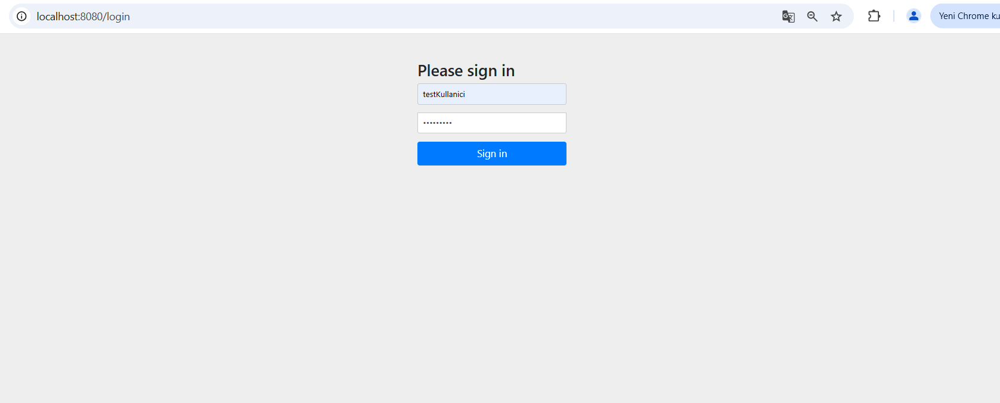
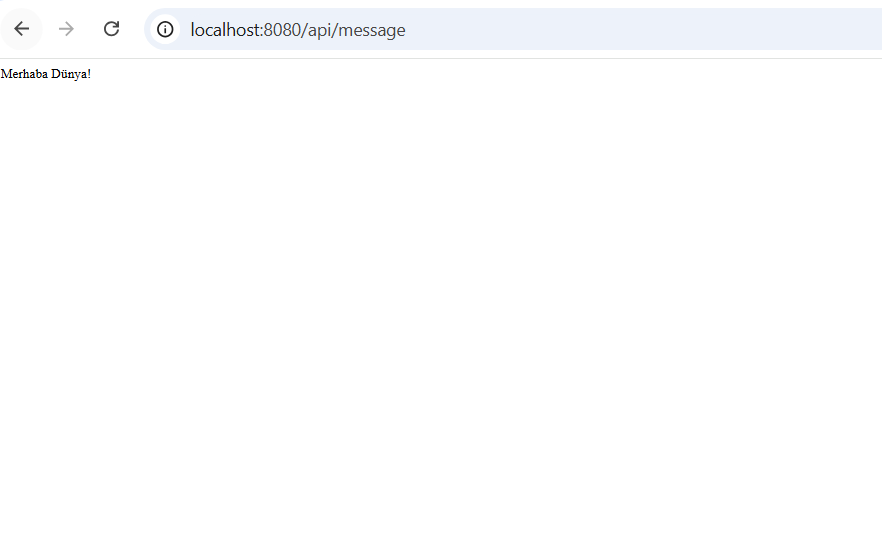
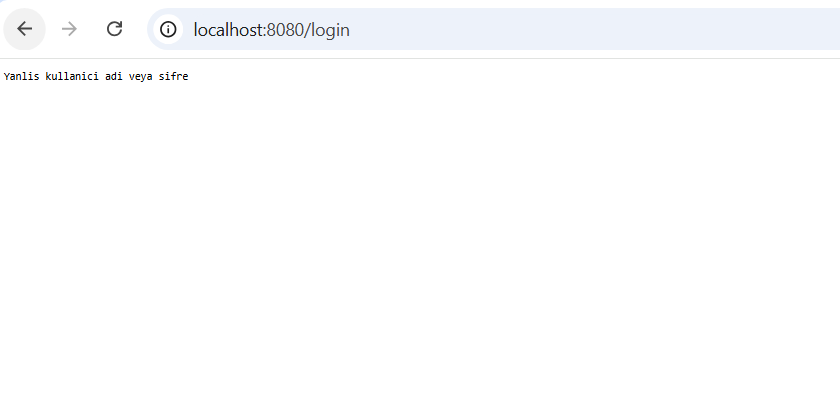
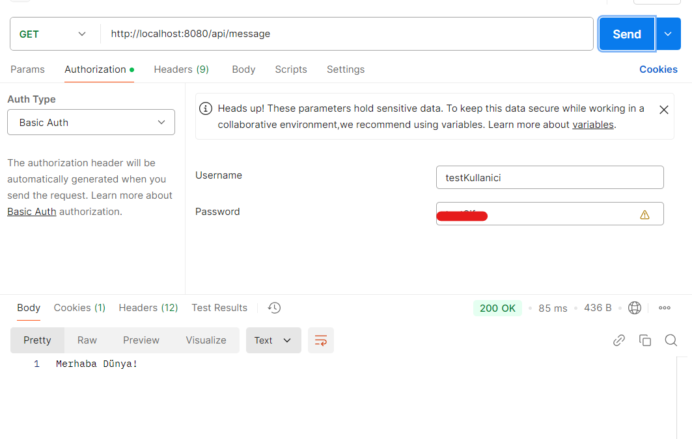
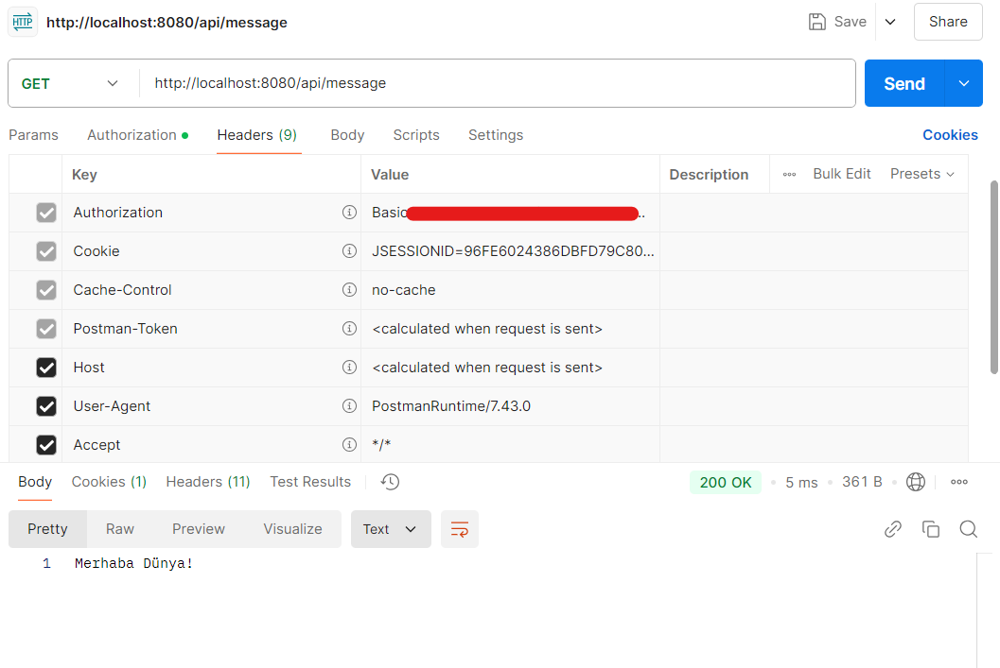
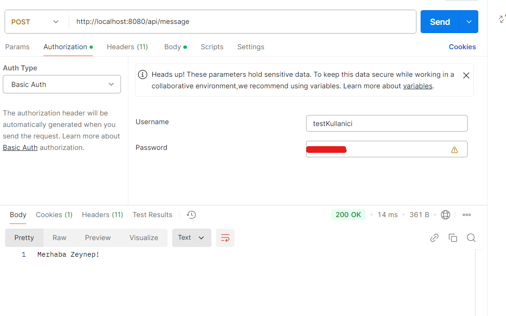
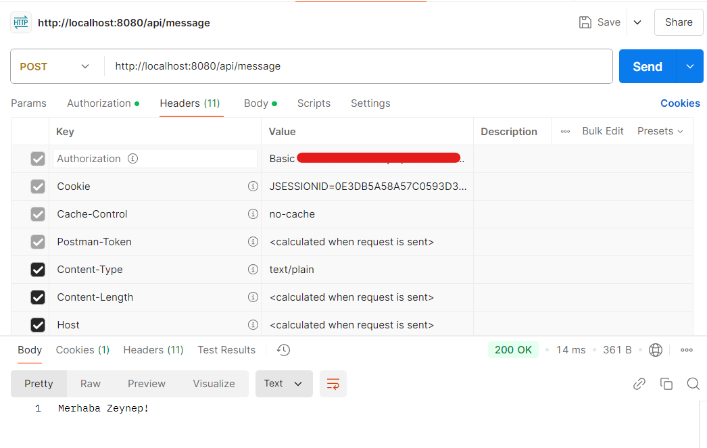

# Hello World Spring Boot Project
## Task 2 - Resources Used

1. [Spring Security Implementation](https://medium.com/@aamir.zaidi5/spring-security-implementation-805520a297d5)
2. [Spring Security Basic Auth](https://thelogiclooms.medium.com/spring-security-basic-auth-d777138b4256)
3. [Spring Boot Uygulamalarında Security Basic Authentication Kullanım Örneği](https://blog.burakkutbay.com/spring-boot-uygulamalarinda-security-basic-authentication-kullanim-ornegi.html/)
4. [Securing API with Basic Authentication in Spring Boot](https://medium.com/javarevisited/spring-boot-securing-api-with-basic-authentication-bdd3ad2266f5)
## Screenshots

### Login Page

### Successful Login

### Failed Login

#### Get Request 

#### Get Base64

#### Post Request

#### Post Base64
